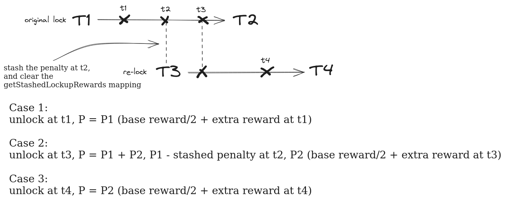
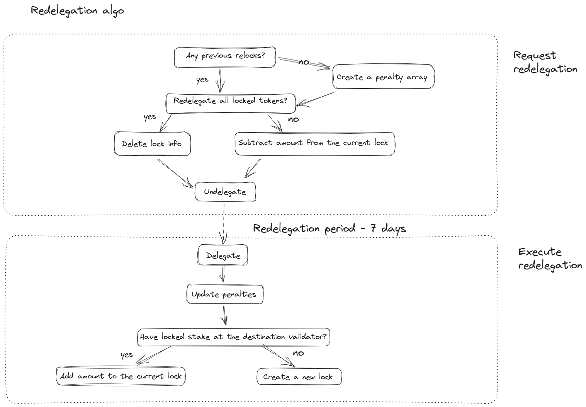

## NEW SFC FEATURES

### RELOCK

#### Motivation

In the current model, old penalties are still applied when a user relocks their stake, even if the old lock duration has passed.

For example, if Alice has locked her tokens for 100 days she will suffer a 500 tokens penalty if she unlocks prematurely, let's say she decides to relock her tokens for another 100 days on the 99th day. 

Even though her old lock has expired, she will still be required to pay a penalty for it if she unlocks her new lock on the 150th day. The total penalty amount will be the sum of P1 and P2, where P1 represents the penalty for the old lock and P2 represents the penalty for the new lock.

#### Summary




We solve this issue with addition of the new structure.
```
struct Penalty {
    uint256 penalty;
    uint256 penaltyEnd;
    uint256 amountLockedForPenalty;
}
```
Everytime user relocks his stake for the new duration, we stash the penalties for his previous lock in the array.
```
// delegator -> validator ID
mapping(address => mapping(uint256 => Penalty[])) public getPenaltyInfo;
```
During the unlock we update the penalty array, delete stale penalties and sum them with the current penalty. As a result, the user is only charged penalties for their current locks, not the expired ones.

We added a new parameter, `maxRelockCount`, to `ConstantsManager` to limit the size of the penalty array.

#### Partial unlocks
It is worth explaining the penalty calculation for partial unlocks, for example, after a relock, Alice has one penalty stashed in her array `(amount: 500, penaltyEnd: 10000, amountLockedForPenalty: 100)`, her current lock amount is 200, and it will end at 20000. She decides to unlock 100 tokens at 8000, so two penalties will be applied: her old penalty and the new one - 800.
We unstash her old penalty P1 = 500 and since the unlock amount is equal to the `amountLockedForPenalty` we take the whole amount and update the penalty in the array `(amount: 0, penaltyEnd: 10000, amountLockedForPenalties: 0)`, P2 is calculated like before `800 * 100 / 200 = 400`, as a result, `P = P1 + P2 = 900`. 

#### Changes

#### ConstantsManager.sol

`maxRelockCount` - stores the maximum size of the penalty array

`updateMaxRelockCount` - updates `maxRelockCount` value

#### SFCState.sol

```
struct Penalty {
    uint256 penalty;
    uint256 penaltyEnd;
    uint256 amountLockedForPenalty;
}
```

- penalty - stored penalty amount
- penaltyEnd - penalty expiration time
- amountLockedForPenalty - amount of tokens that was locked for this penalty

`getPenaltyInfo` - stores all active penalties for the delegator-validator pair

#### SFCLib.sol

`refreshPenalties` - deletes stale penalties

#### StakingHelper

`_getStashedPenaltyForUnlock` - updates the penalty array and calculates a summary penalty based on `unlockAmount` and `amountLockedForPenalty` ratio.

### REDELEGATION

#### Motivation

Redelegation feature will allow users to seamlessly delegate their locked tokens to another validator without the need to unlock them first and pay penalties for this.

#### Summary



Redelegation process consists of two phases. During the first phase user calls `requestRedelegation` function where he specifies the validator ID he wishes to redelegate from and the amount of tokens. Redelegation amount should not be greater than a current locked amount for this validator. After this we undelegate and unlock the tokens, save the redelegation info and update the penalty array. 

To proceed to the next phase, the user needs to wait a specified amount of time (e.g. 7 days), when this period ends, he can call `executeRedelegation` where he selects a validator to delegate his tokens to. We then retrieve the stored redelegation request info and use it to delegate and lock the tokens to the new validator. If the user has previous locks on this validator, we add the redelegated amount; if there are no locks we create a new one with the parameters from the previous lock.

#### Changes

#### ConstantsManager.sol

`redelegationPeriodTime` - stores the amount of time before user is allowed to execute redelegation request

`updateRedelegationPeriodTime` - updates `redelegationPeriodTime` value

#### SFCState.sol

```
struct RedelegationRequest {
    uint256 time;
    uint256 prevLockDuration;
    uint256 prevLockEndTime;
    uint256 amount;
    Penalty[] penalties;
}
```

- time - request timestamp
- prevLockDuration - duration of the lock we want to redelegate
- prevLockEndTime - expiration time of the lock we want to redelegate
- amount - redelegation amount
- penalties - penalties array from previous locks

`getRedelegationRequest` - request storage

#### SFCLib.sol

`requestRedelegation` - creates a new redelegation 

`executeRedelegation` - finalizes the redelegation

#### StakingHelper

`_movePenalties` - appends delegator's penalty array with new records

`_splitPenalties` - splits all penalties in the array based on `splitAmount` and `amountLockedForPenalty` ratio

### SFCLib MERGE

